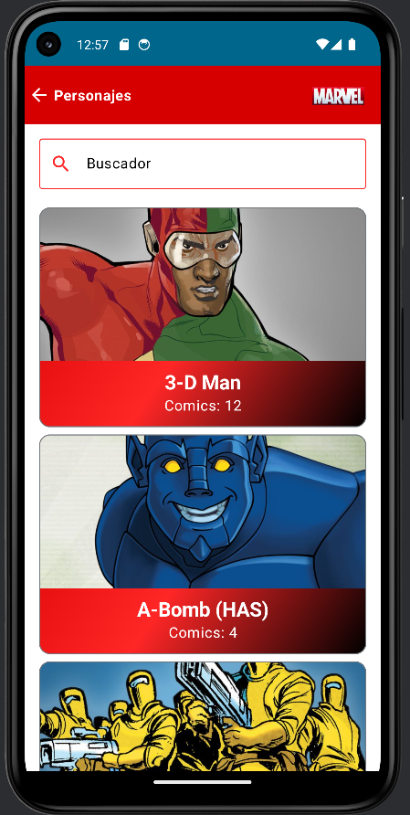
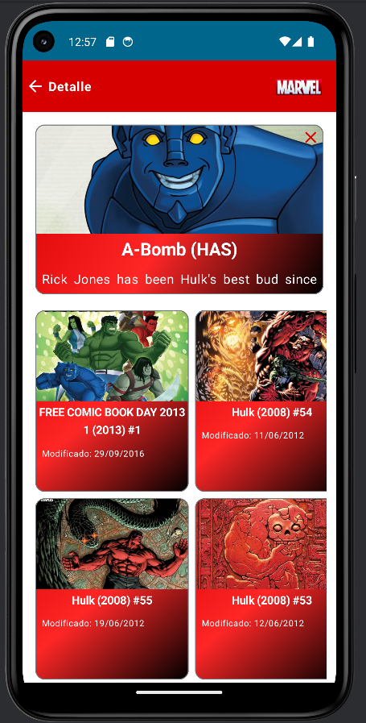

# Marvels-App

This application is used to search for marvel characters and see a brief description and the comics in which the character appears.

## Technologies

- Architecture MVVM 
- Clean code
- Navigation Component
- Gradle KTS
- Dependency Injections (Dagger Hilt)
- StateFlow
- Coroutines
- Retrofit, interceptors and mappers
- Jetpack Compose
- Animations
- UnitTest

## ScreenShots

|                             Splash                             |                             Home                             |
|:--------------------------------------------------------------:|:------------------------------------------------------------:|
|  |  |

|                             Keys                             |
|:------------------------------------------------------------:|
|  |

|                             Gallery                             |                             Detail                             |
|:---------------------------------------------------------------:|:--------------------------------------------------------------:|
|  |  |

---

## Development Environment

This repository is ready to import Android Studio, configured with Java 17 and Gradle. In order to request the Marvel API you should follow the following steps

Steps to follow to make the app work once installed:

- 1- first we obtain the keys necessary for the application to function correctly. These keys can be found on the page: https://developer.marvel.com/
- 2- secondly we have to create an account if we don't already have one to access and obtain the keys.
- 3- Once we are registered we go to the section to get apiKey
- 4- Finally, we add the keys to the application, both the apikey and the privateKey, and we can use our application normally.

---

## Architecture

A clean architecture with SOLID principles has been followed in this repository. And the project contains 3 main layers data, domain, ui. These layers are connected to each other by means of dependency injection. In addition, a single activity and viewmodel has been considered as the project is not very large.

---

## Layers

As mentioned above, the project is divided into 3 main layers: data, domain and ui.

### Data layer
The project has only one remote database that uses the 'core/di/NetworkModule' to inject the Retrofit. It is represented by a Retrofit `interface` requested by the data source suspended functions implementations where the raw Retrofit `Response` is processed to return it corresponding model or error wrapped 

The repository implementation orchestrates the data sources and maps the response model to a domain model with the key properties.

This layer is requested by the repository `interface` defined in the `domain` layer.

**This layer do not have any android dependencies**. 

### Domain layer

The domain layer does not depend on any layer. It contains the repository definition that expect to returns domain models, also has the app business actions, like get the characters or search for one, these are simple commands because of that they are kotlin functional interfaces. 

This layer is requested by the use case `interface`.

**This layer do not have any android dependencies**. 

### UI layer

In this layer we have the `activity` to paint the corresponding views according to the flow of the application with the help of the `viewmodel` for the logic. Navigation between views is implemented with `Navigation component` and each view is implemented in `Compose`. Each view has its own file and there is also a `component file` that helps the other views with some general components.

From this layer, all requests are executed through corrutines in the viewmodel. These use cases are added to the viewmodel through dependency injection and depending on the expected behaviour of the views the viewmodel will execute them at the required time.

The application enables dark mode with a switch on the top right bar.

---

## Linting and Testing

### Testing

To achieve this, the unit tests were leveraged on Junit5 and Mockk, in a mix of mocks and fakes. The component under test is a spy that is executed with its real behavior and its dependencies are mocks that return fakes. All the tests have assertions besides exhaustive verifications and confirmations.

---

## Next Steps

### Development Environment

- Create product flavors.
- Improve Gihub Actions CI (releases and tags creation).
- Add Benchmarks.

### Features

- Implement favorites view.
- Improve search view with filters.
- Add `SnackBar`s for show connections/server issues and retry.

### Architecture

- Creation of local data sources (Favorites feature).
- Review the design of complex use cases.

### Test and linting

- Add Detekt and Ktlint for ensure style and good practices
- Add app instumented test.
- Add navigation test.
- Add mock web server.

### Technical Debt

- Add full suit of API error tests.
- Instrumented test runs with real requests.
- Improve resources definitions (themes, string, styles, etc.).

---

## Attributions

You must attribute Marvel as the source of data whenever you display any results from the Marvel Comics API. Please use the following text on every application screen or web page which displays the API result:
"Data provided by Marvel. © 2014 Marvel"

### Linking to Marvel
Linking from your application and web pages to Marvel helps us understand how applications are being used by end-users, which applications are most successful, and which presentations of Marvel content is most impactful, all of which helps us improve our API products.

You must link to Marvel whenever you show any information from the API beyond the title and small (100px width or smaller) thumbnail of an entity. For example, displaying a set of comics with only the title and small thumbnail would require only the attribution language above. If that same set were displayed with any additional information, each comic would need to have a link back to one or more of the URLs associated with that comic.

#### Links from URL arrays
Most entities return URL arrays, which are one or more public URLs associated with an entity. For example, a comic may have a URL array that contains a link to its detail page on Marvel.com, a link to purchase it on the web, and a link to the Marvel digital comics reader for that comic.

If a URL array is present for an entity, please use one of the links provided when linking back to Marvel. Feel free to use any of the URLs present, whichever makes most sense for your application. (URL block links are automatically tagged with your API key so that we can properly credit your web site or application with any traffic driven from your link.)

#### Linking back when no URL array is present
If a URL array is not present for an entity simply link to the Marvel.com home page (http://marvel.com) in your attribution notice.
