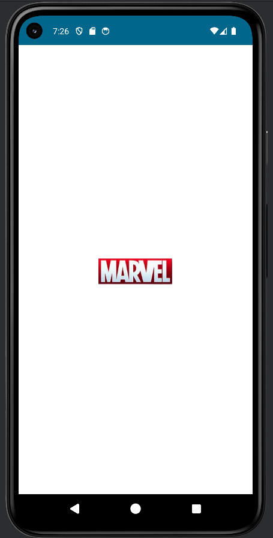

# Marvels-App

This application is used to search for marvel characters and see a brief description and the comics in which the character appears.

## Technologies

- Architecture MVVM 
- Clean code
- Navigation Component
- Gradle KTS
- Dependency Injections (Dagger Hilt)
- StateFlow
- Coroutines
- Retrofit, interceptors and mappers
- Jetpack Compose
- Animations
- UnitTest

---

## Views

|                             Splash                             |                             Home                             |
|:--------------------------------------------------------------:|:------------------------------------------------------------:|
|  |  |

|                             Keys                             |
|:------------------------------------------------------------:|
|  |

|                             Gallery                             |                             Detail                             |
|:---------------------------------------------------------------:|:--------------------------------------------------------------:|
|  |  |

## Installation

Steps to follow to make the app work once installed:

- 1- first we obtain the keys necessary for the application to function correctly. These keys can be found on the page: https://developer.marvel.com/
- 2- secondly we have to create an account if we don't already have one to access and obtain the keys.
- 3- Once we are registered we go to the section to get apiKey
- 4- Finally, we add the keys to the application, both the apikey and the privateKey, and we can use our application normally.

## Attributions

You must attribute Marvel as the source of data whenever you display any results from the Marvel Comics API. Please use the following text on every application screen or web page which displays the API result:
"Data provided by Marvel. © 2014 Marvel"

### Linking to Marvel
Linking from your application and web pages to Marvel helps us understand how applications are being used by end-users, which applications are most successful, and which presentations of Marvel content is most impactful, all of which helps us improve our API products.

You must link to Marvel whenever you show any information from the API beyond the title and small (100px width or smaller) thumbnail of an entity. For example, displaying a set of comics with only the title and small thumbnail would require only the attribution language above. If that same set were displayed with any additional information, each comic would need to have a link back to one or more of the URLs associated with that comic.

#### Links from URL arrays
Most entities return URL arrays, which are one or more public URLs associated with an entity. For example, a comic may have a URL array that contains a link to its detail page on Marvel.com, a link to purchase it on the web, and a link to the Marvel digital comics reader for that comic.

If a URL array is present for an entity, please use one of the links provided when linking back to Marvel. Feel free to use any of the URLs present, whichever makes most sense for your application. (URL block links are automatically tagged with your API key so that we can properly credit your web site or application with any traffic driven from your link.)

#### Linking back when no URL array is present
If a URL array is not present for an entity simply link to the Marvel.com home page (http://marvel.com) in your attribution notice.