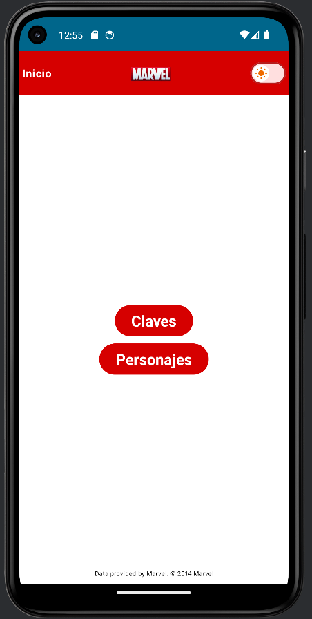

# Marvels-App

This application is used to search for marvel characters and see a brief description and the comics in which the character appears.

## Technologies

- Architecture MVVM 
- Clean code
- Navigation Component
- Gradle KTS
- Dependency Injections (Dagger Hilt)
- StateFlow
- Coroutines
- Retrofit, interceptors and mappers
- Jetpack Compose
- Animations
- UnitTest

---

## Views

|                             Splash                             |                             Home                             |
|:--------------------------------------------------------------:|:------------------------------------------------------------:|
|  |  |

|                             Gallery                             |                             Detail                             |
|:---------------------------------------------------------------:|:--------------------------------------------------------------:|
|  |  |
